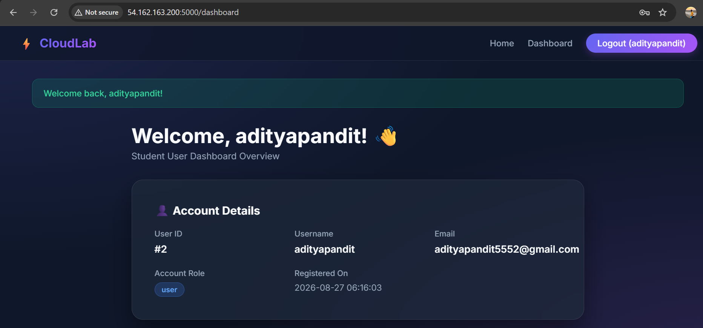
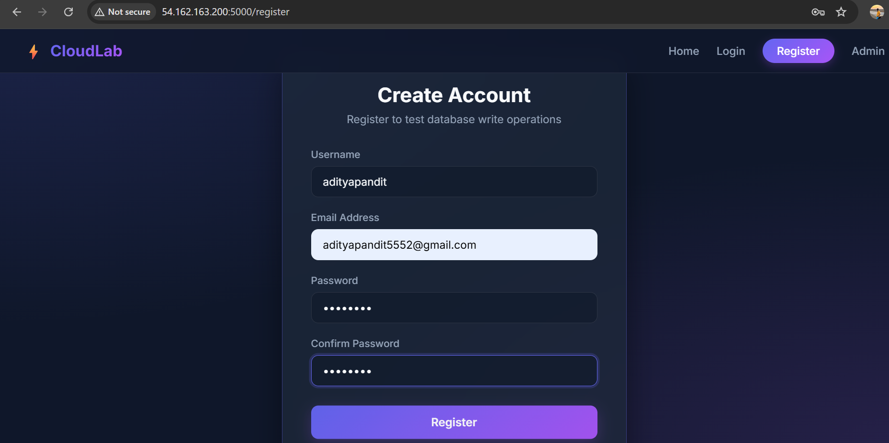
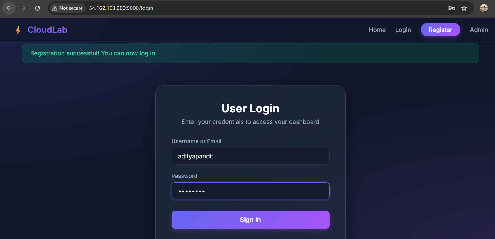
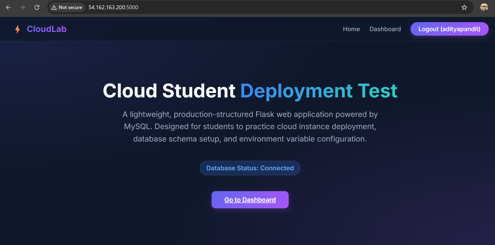
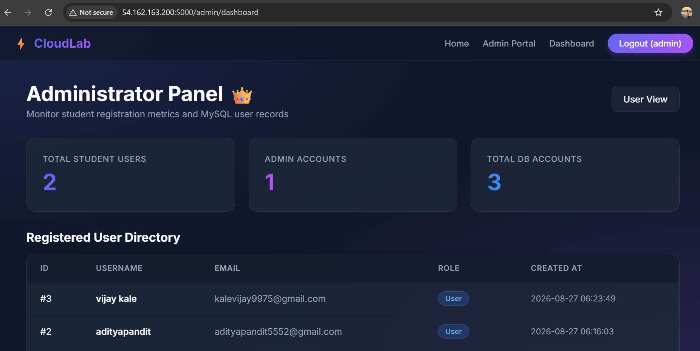
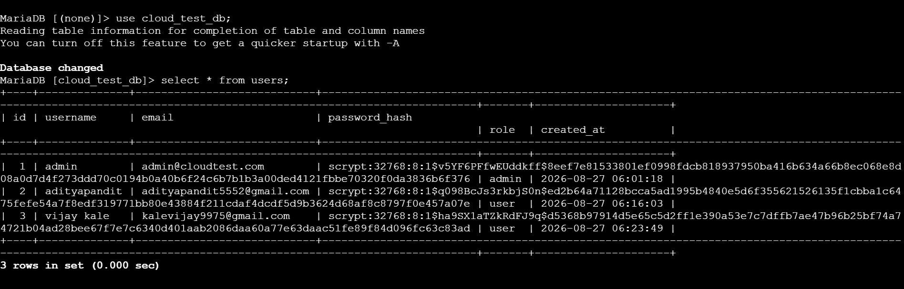

# Flask + MySQL Cloud Deployment Lab

A lightweight, modern Flask web application integrated with a MySQL/MariaDB database. Built as a practical lab exercise for cloud computing students to practice deploying a Python web application with a relational database on cloud infrastructure (AWS EC2, Azure VMs, GCP Compute, Heroku, Render, etc.).

---

## Features

| Feature | Description |
|---|---|
| **User Registration** | Create new accounts with secure password hashing via Werkzeug |
| **Login & Session Management** | Session-based authentication for both users and administrators |
| **User Dashboard** | Protected page displaying account details and metrics |
| **Password Reset** | Update a password using a registered username or email |
| **Admin Portal** | Separate admin login with a dashboard showing total users and a full user directory |
| **Glassmorphism Dark Theme** | Responsive, modern UI with status badges and subtle animations |

---

## Project Structure
---
     Python-Flask-Practical-Project/
     ├── app.py # Core Flask routes & PyMySQL logic
     ├── config.py # Environment configuration loader
     ├── schema.sql # Database setup & admin seed queries
     ├── requirements.txt # Python package dependencies
     ├── .env.example # Environment variable template
     ├── .env # Local environment variables (not committed)
     ├── README.md # Project documentation
     ├── home.png
     ├── createaccount.png
     ├── loginpage.png
     ├── dashboard.png
     ├── AdministratorPanel.png
     └── Databases.png
     ├── templates/
     │ ├── base.html # Base layout, navigation & toast alerts
     │ ├── index.html # Landing page with DB connection status
     │ ├── register.html # User registration page
     │ ├── login.html # User login page
     │ ├── reset_password.html # Password reset page
     │ ├── dashboard.html # User dashboard
     │ ├── admin_login.html # Administrator login portal
     │ └── admin_dashboard.html # Admin panel — user counts & directory
     ├── static/
         └── css/
             └── style.css # Glassmorphism dark-mode design system


## Database Setup

### Option A — Run the schema file directly

```bash
mysql -u root -p < schema.sql
```

### Option B — Run the SQL manually

```sql
-- Create the database
CREATE DATABASE IF NOT EXISTS `cloud_test_db`
  DEFAULT CHARACTER SET utf8mb4 COLLATE utf8mb4_unicode_ci;

USE `cloud_test_db`;

-- Create the users table
CREATE TABLE IF NOT EXISTS `users` (
    `id`            INT AUTO_INCREMENT PRIMARY KEY,
    `username`      VARCHAR(50)  NOT NULL UNIQUE,
    `email`         VARCHAR(100) NOT NULL UNIQUE,
    `password_hash` VARCHAR(255) NOT NULL,
    `role`          ENUM('user', 'admin') DEFAULT 'user',
    `created_at`    TIMESTAMP DEFAULT CURRENT_TIMESTAMP
) ENGINE=InnoDB DEFAULT CHARSET=utf8mb4;

-- Seed a default admin user (password: admin123)
INSERT INTO `users` (`username`, `email`, `password_hash`, `role`)
VALUES (
    'admin',
    'admin@cloudtest.com',
    'scrypt:32768:8:1$7nXZwQ3p6Yp7$24c883ed6df65ecf50a8b9eeb2db8fa0b555d4ee7e3fa4923e5904d9c791dd15e3474327299a9cfb0114ae39f7a77d54238eeb5ca5d1e2e4efcf291bfecf074d',
    'admin'
)
ON DUPLICATE KEY UPDATE `username` = `username`;
```

> **Note:** the seed hash above corresponds to `admin123`. If you regenerate it locally, make sure to use the same Werkzeug version installed in `requirements.txt` so the hash format matches.

---

## Quickstart

### 1. Clone the repository

```bash
git clone <repository_url>
cd Python-Flask-Practical-Project
```

### 2. Create and activate a virtual environment

```bash
# Windows
python -m venv venv
venv\Scripts\activate

# Linux / macOS
python3 -m venv venv
source venv/bin/activate
```

### 3. Install dependencies

```bash
pip install -r requirements.txt
```

### 4. Configure environment variables

```bash
# Windows (PowerShell)
Copy-Item .env.example .env

# Linux / macOS
cp .env.example .env
```

Edit `.env` with your own MySQL credentials:

```env
MYSQL_HOST=localhost
MYSQL_PORT=3306
MYSQL_USER=root
MYSQL_PASSWORD=your_mysql_password
MYSQL_DB=cloud_test_db

SECRET_KEY=super_secret_cloud_test_key
PORT=5000
```

> `.env` is gitignored — never commit real credentials to version control.

### 5. Run the application

```bash
python app.py
```

Visit **http://localhost:5000** locally, or **http://\<your-cloud-instance-ip\>:5000** when deployed.

---

## Default Admin Credentials

| Field | Value |
|---|---|
| Username | `admin` |
| Email | `admin@cloudtest.com` |
| Password | `admin123` |
| Admin Portal | `/admin/login` |

> ⚠️ **Security note:** change this password immediately if the instance is reachable from the public internet. Default credentials should never persist on a live, externally accessible deployment.

---

## Screenshots

### Home Page


### User Registration


### User Login


### User Dashboard


### Administrator Panel


### Database


---

## License

This project is intended for educational use as part of a cloud computing lab exercise.
